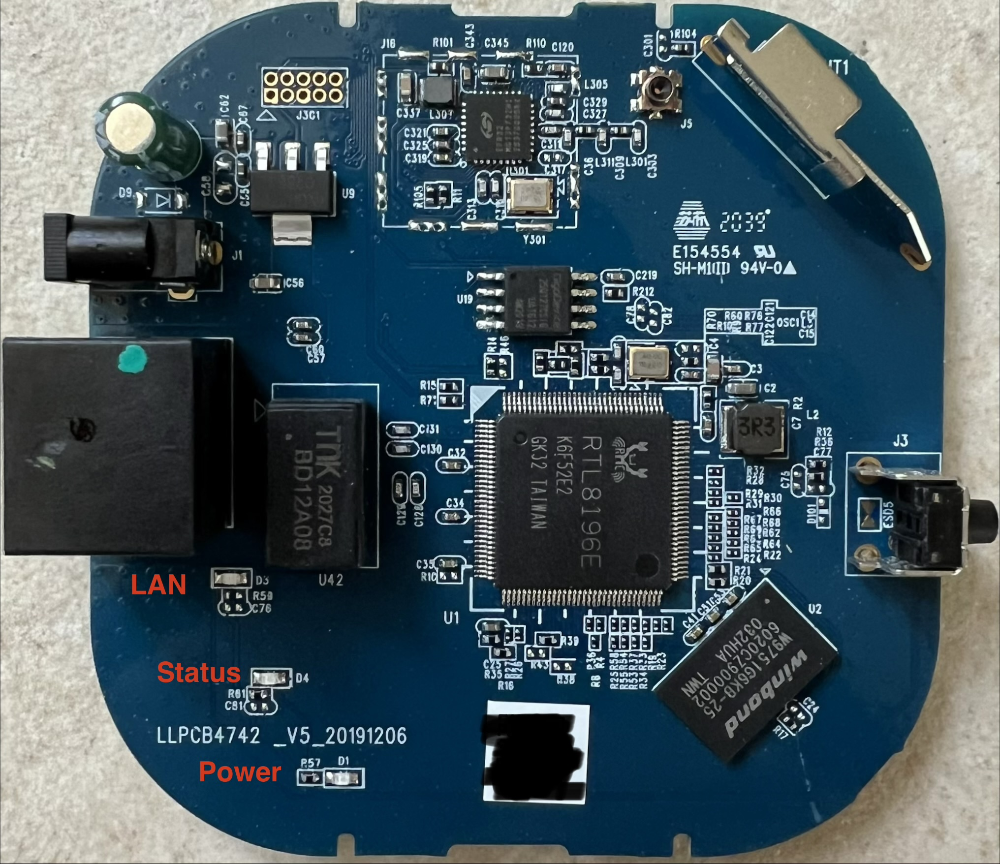
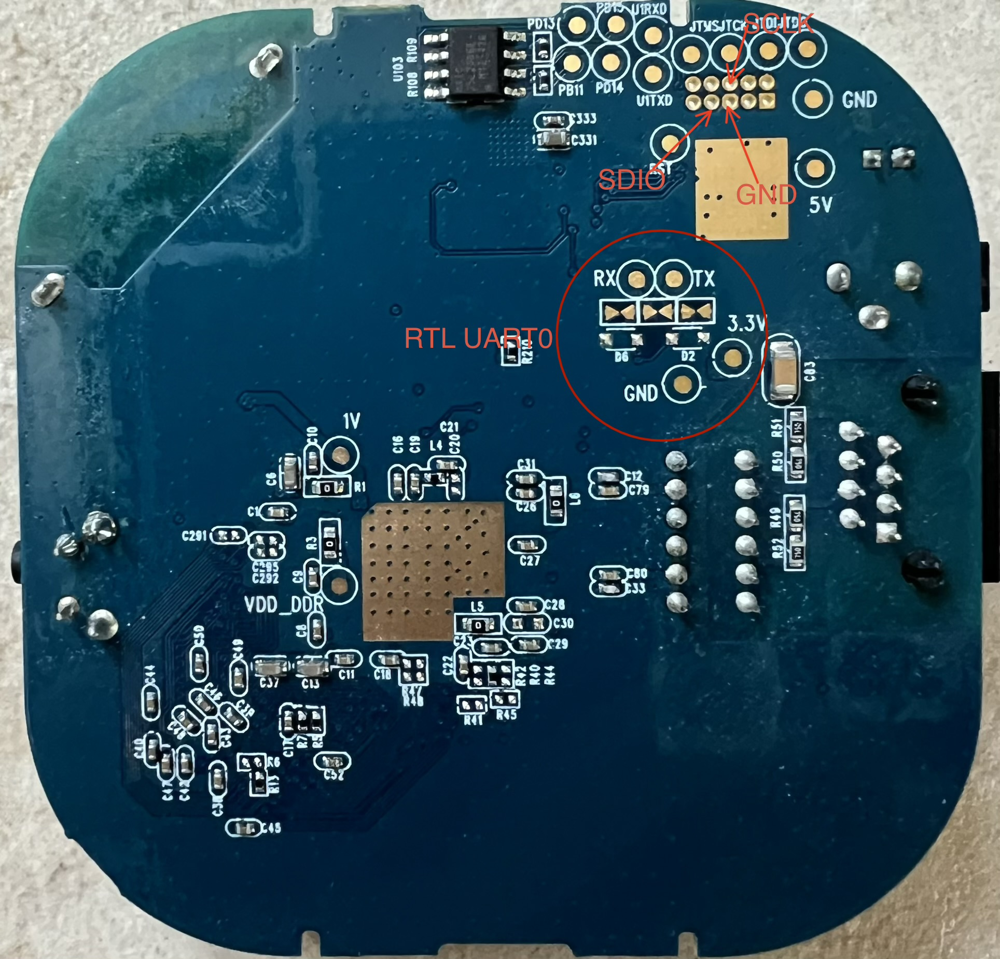

# Sengled Smart Hub G4 (E39-G8C) — Hardware Overview

This section provides a detailed breakdown of the Sengled Smart Hub G4's
hardware. It includes component identification, debug interface
pinout, and serial specifications to help you understand and repurpose the
device.

______________________________________________________________________

## 🧱 Physical Construction

- Screwless case held by 4 plastic clips evenly distributed along the edges
- Clips require careful prying to open the lid
- Single PCB housing all components

______________________________________________________________________

## 📸 Main PCB Overview

  

  

______________________________________________________________________

## 🔩 Main Components

### 1. Main Processor (U1)

- **SoC**:
  [Realtek RTL8196E](../datasheet/RTL8196E-CG-datasheet.PDF)
- 32-bit Lexra RLX4181 core (MIPS32-compatible, big-endian)
- Lacks unaligned memory access; uses MIPS16e compressed instructions
- Runs at 400 MHz
- Embedded Ethernet switch with 3 logical interfaces: `eth0`, `eth1`, and
  `peth0` (virtual)
- Serial: two 16550A-compatible UARTs at MMIO addresses `0x18002000` and
  `0x18002100`
- SPI controller used to access external NOR flash

### 2. Flash Memory (U19)

- 16MiB SPI NOR Flash
  ([GD25Q127](../datasheet/GD25Q127C_datasheet.pdf))
- 64KiB erase blocks
- Stores bootloader, Linux kernel, SquashFS rootfs, and JFFS2 persistent
  data

### 3. RAM (U2)

- 64MiB DDR2
  ([W9751G6KB-25](https://www.mouser.com/datasheet/2/949/w9751g6kb_a09_20170123-1489769.pdf?srsltid=AfmBOop-SMpXBFkQo-65eLaWz0EHKph5kVXLuGpPklsK94s5HG589BE-))
  or equivalent

### 4. Radio IC(U301)

- Silicon Labs: EFR32MG13P732F512IM32
- ARM Cortex-M4 core with integrated Zigbee stack
- Connected to RTL8196E via UART1 without _CTS/RTS_
- Hosts the Zigbee firmware (typically NCP/UART)

#### Additional Flash Memory attached to Radio IC(U103)

- 256KiB SPI NOR Flash: [MXIC 25L2006E ](https://www.macronix.com/Lists/Datasheet/Attachments/8701/MX25L2006E,%203V,%202Mb,%20v1.6.pdf)

### 5. Debug/Programming Interface (J301) 

- See markers in [Back PCB Picture](./images/pcb_back.jpg)
- JTAG/SWD debug port for Radio IC
  - Not populated by default (1.26mm header needed)
- RTL8196E UART0

______________________________________________________________________

## 🔌 Serial Port Specifications

- Logic level: TTL 3.3V
- Baud rate: 38400 bps
- Configuration: 8 data bits, no parity, 1 stop bit (8N1)

______________________________________________________________________

## 🧩 Additional Components

- Ethernet magnetics
- Status LEDs:
  - Ethernet activity
  - Zigbee communication
  - Power Supply
- See markers [Front PCB Picture](./images/pcb_front.jpg)
- Supporting discrete components (caps, resistors, etc.)

______________________________________________________________________

## 🧠 Design Summary

- Clean, well-structured single-board design
- Minimalist layout with clearly separated domains (SoC / Zigbee)
- Accessible debug interface and test points for hardware hacking
- Suitable for firmware customization and hardware-based reverse
  engineering
