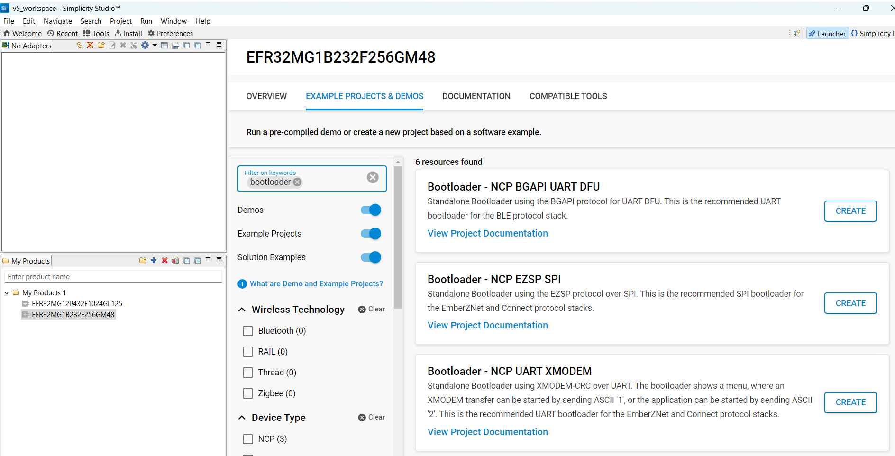
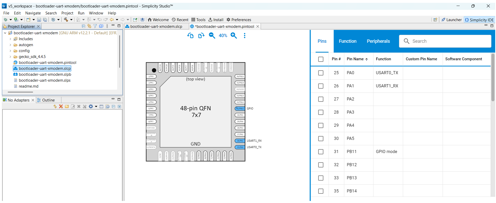
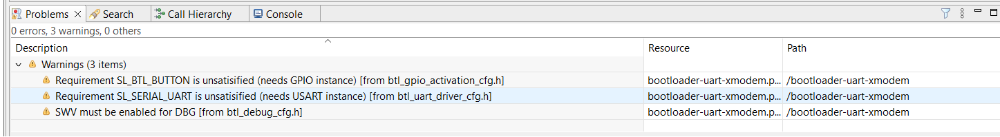
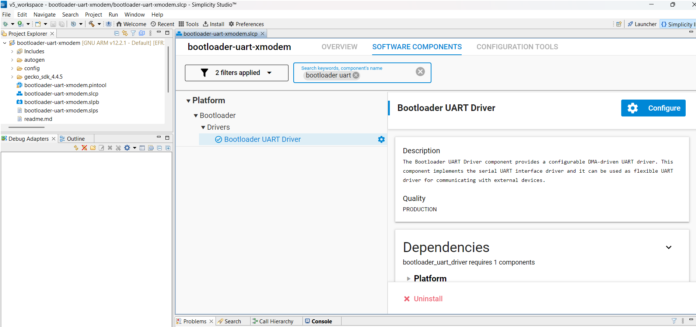
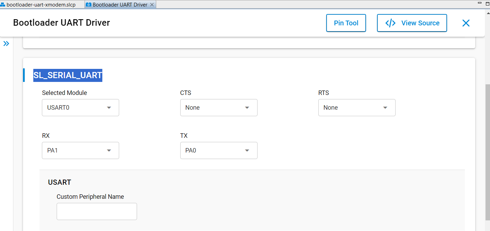
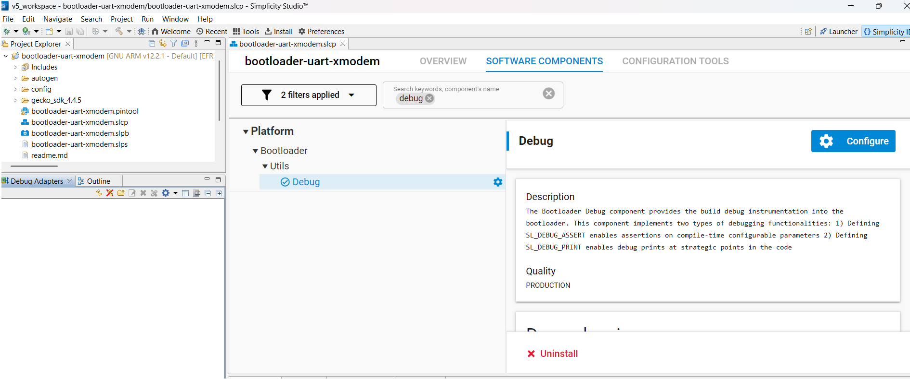
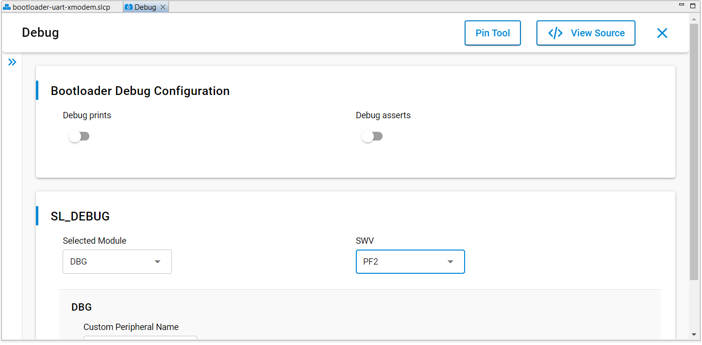
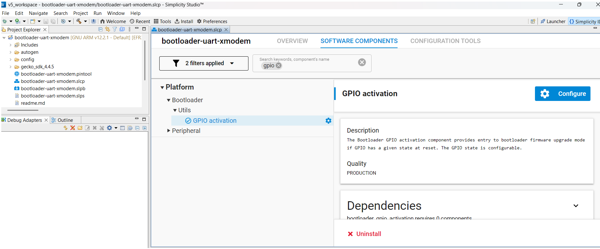

# Creating the Bootloader-UART-Xmodem firmware

## Step 1: Load the bootloader-uart-xmodem demo file for EFR32MG1B232F256GM48

The `bootloader-uart-xmodem` firmware is available by default as an example application for the `EFR32MG1B232F256GM48` chip.

1. In the **Launcher** tab, add the `EFR32MG1B232F256GM48` part to the **My Products** list, then click **Start**.


2. In the **Example Projects and Demos** tab, search for `bootloader` and create the `Bootloader - NCP UART XMODEM` project.

   <p align="center">
     
   </p>

3. Accept default options and click **Finish**. Wait until the C/C++ indexation is complete.

Now, we are ready to build an `bootloader-uart-xmodem` firmware for our target device.

   <p align="center">
     
   </p>

---

## Step 2: Pin Assignment

1. In the **Configuration Tools** panel, open the **Pin Tool**.
2. Assign `PA0`, `PA1`, `PB11` respectively to USART0_TX, USART0_RX and GPIO as shown below:

   <p align="center">
     
   </p>

3. Exit the **Pin Tab** and save.

---

## Step 3: Fix Pre-compilation Warnings
We want to get rid of the following pre-compilation warnings:
   <p align="center">
     
   </p>

1. Go back to the **Project Main Panel** and open the **Software Components** tab.
2. Set the filter to `Installed`.
3. Search for `Bootloader UART Driver`.

   <p align="center">
     
   </p>

4. Open the component editor for `Bootloader UART Driver` and assign `USART0` to `SL_SERIAL_UART` Selected Module.

   <p align="center">
     
   </p>
   Exit.

5. Search for `debug`.

   <p align="center">
     
   </p>

6. Open the component editor for `Debug` and assign `PF2` to `SWV`.

   <p align="center">
     
   </p>
   Exit.

7. Search for `gpio`.

   <p align="center">
     
   </p>

8. Open the component editor for `GPIO activation` and assign `PB11` to `SL_BTL_BUTTON`.

   <p align="center">
     
   </p>
   Exit.
At this stage, the initial pre-compilation warnings should have disappeared.

---

## Step 4: post-build command file
The `bootloader-uart-xmodem` demo file includes by default a post-build configuration file (*.slpb) which, when edited, looks like this:
   ```
   ---
   parameters:
   - name: "build_dir"
   constants:
   - name: "project_name"
     value: "bootloader-uart-xmodem"
   steps:
   - task: "convert"
     output: "artifact/{{project_name}}.s37"
     export: "bootloader_main_stage"
     input: "{{build_dir}}/{{project_name}}.out"
   - task: "convert"
     output: "artifact/{{project_name}}-crc.s37"
     export: "bootloader_crc_binary"
     input: "artifact/{{project_name}}.s37"
     crc: true
   - task: "convert"
     output: "artifact/{{project_name}}-combined.s37"
     export: "bootloader_binary"
     input:
     - "autogen/first_stage.s37"
     - "artifact/{{project_name}}-crc.s37"
   ```
This file defines the post-build operations for creating the bootloader files for the EFR32MG1B232F256GM48 device and is used by `Simplicity Commander` to generate the necessary bootloader files after compilation.

The file defines a sequence of tasks that convert the compiled output into three different bootloader image formats.

    Main bootloader (bootloader-uart-xmodem.s37)
    Main bootloader with CRC32 (bootloader-uart-xmodem-crc.s37)
    Combined first stage + main bootloader (bootloader-uart-xmodem-combined.s37)
---

## Step 7: build the firmware

Right-click on the project name (`bootloader-uart-xmodem`) in the left-panel and click on `Build Project`. 
The compilation should run without any errors. The three generated *.s37 files are located in the `C:\Users\Username\SimplicityStudio\v5_workspace\bootloader-uart-xmodem\artifact\` directory ready to be flashed with `commander`.

---

## 🧠 Understanding the 2-Stage Bootloader Architecture (Series 1)

EFR32MG1B (Gecko Series 1) devices use a **two-stage bootloader system**:

- **Stage 1 – First-stage bootloader (BSL)**:
  - Resides in main flash memory starting at address 0x0
  - Minimal: verifies and launches Stage 2.
  - Cannot be updated via UART or OTA.
  - Can only be overwritten using **SWD and a debugger**.

- **Stage 2 – Main bootloader**:
  - Resides in main flash memory starting at address 0x800
  - Can be updated in the field (UART or OTA) using `.gbl` packages (*Not recommanded*)

- **Applications (NCP-UART, RCP-UART,...)**:
  - Resides flash memory starting at address 0x4000
  
---

## 🛠 Updating the Bootloader via SWD and Simplicity Commander

When you have access to the SWD interface and a debugger, the recommended and most reliable method to update the bootloader is by flashing the entire bootloader image using Simplicity Commander.

This method allows you to update **both the first-stage bootloader (at address 0x0000)** and the **main bootloader (stage 2, at address 0x0800)** in a single operation, bypassing the limitations of UART or OTA updates.

### 🔹 Procedure

1. **Connect the SWD interface** (SWDIO, SWCLK, GND, +3V) to a supported debugger (e.g., J-Link or EFM32).
   Refer to the [Backup-Flash-Restore](../12-Backup-Flash-Restore) section for connection details.

2. Flash the combined bootloader `.s37` file generated during the build process:
   ```sh
   commander flash bootloader-uart-xmodem-combined.s37 --device EFR32MG1B232F256GM48
   ```

   You should see output similar to:
   ```sh
   Parsing file bootloader-uart-xmodem-combined.s37...
   Writing 16384 bytes starting at address 0x00000000
   Comparing range 0x00000000 - 0x00003FFF (16 KiB)
   Programming range 0x00000000 - 0x00001FFF (8 KiB)
   Programming range 0x00002000 - 0x00003FFF (8 KiB)
   DONE
   ```

> ✅ This approach overwrites both stages of the bootloader and ensures a clean, consistent update. It should always be preferred over UART-based methods when physical access is available.


## 🔁 After Bootloader Update: Restore Application

After a bootloader update, restore your app through `commander`.


## 🧩 Creating Combined Images (Bootloader + Application)

If you want to **update both the bootloader (stage 2)** and the **application** in one go **via UART**, you can generate a combined `.gbl` file. This avoids the need for a hardware debugger and SWD connection when updating the second-stage bootloader.

> ⚠️ This method only works for the **main bootloader (stage 2)**, not for the full two-stages bootloader (which still requires SWD access).

### 🔹 Create GBL with Bootloader and Application

To combine the bootloader and your application in a single upgrade file:

```sh
commander gbl create myupgrade.gbl --app myapp.s37 --bootloader bootloader-uart-xmodem.s37
```

> ⚠️ **Important**: Use the non-CRC version of the `.s37` bootloader file. `commander` automatically appends the CRC during `.gbl` creation. Do **not** use the `-crc.s37` version here.

You can then upload this `.gbl` file via the UART XMODEM bootloader using a `firmware_upgrade.sh` script.

