# Creating the RCP-UART-HW firmware

## Step 1: Load the RCP-UART-HW Demo File for EFR32MG1B232F256GM48

The `RCP-UART-HW` firmware is available by default as an example application for the `EFR32MG1B232F256GM48` chip.

1. In the **Launcher** tab, add the `EFR32MG1B232F256GM48` part to the **My Products** list, then click **Start**.


2. In the **Example Projects and Demos** tab, search for `zigbee` and create the `Multiprotocol (OpenThread+Zigbee) - RCP (UART)` project.

   <p align="center">
     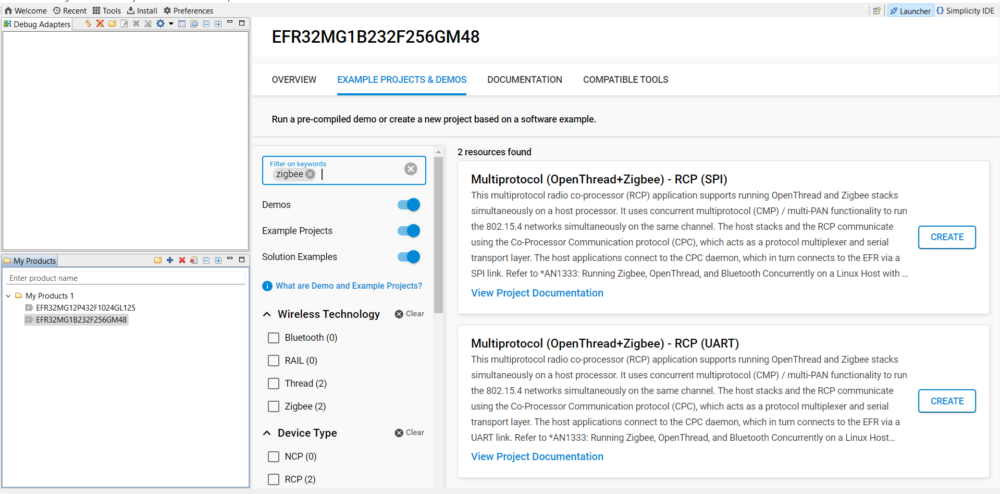
   </p>

3. Accept default options and click **Finish**. Wait until the C/C++ indexation is complete.

Now, we are ready to build an `RCP-UART-802154` firmware for our target device.

   <p align="center">
     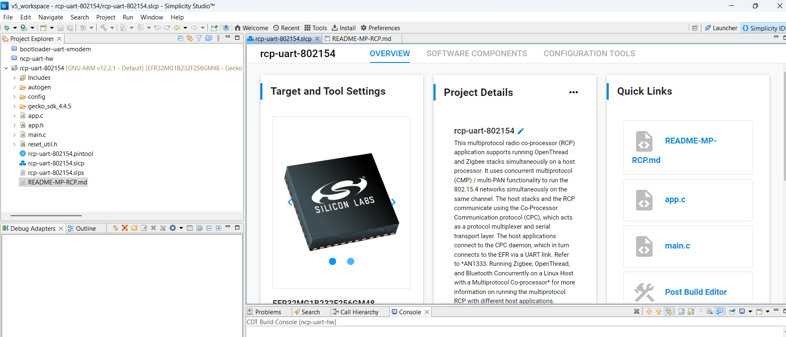
   </p>

---

## Step 2: Pin Assignment

1. In the **Configuration Tools** panel, open the **Pin Tool**.
2. Assign `PA0`, `PA1`, `PA4`, and `PA5` respectively to USART0_TX, USART0_RX, USART0_RTS and USART0_CTS as shown below:

   <p align="center">
     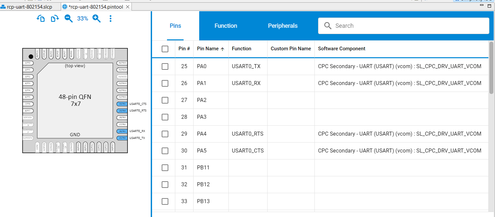
   </p>

3. Exit the **Pin Tab** and save.

---

## Step 3: Fix Pre-compilation Warnings
We want to get rid of the following pre-compilation warnings:
   <p align="center">
     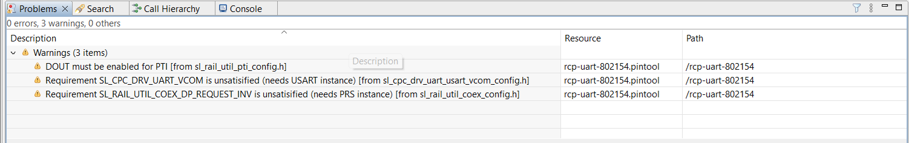
   </p>

1. Go back to the **Project Main Panel** and open the **Software Components** tab.
2. Set the filter to `Installed`.
3. Search for `vcom`.

   <p align="center">
     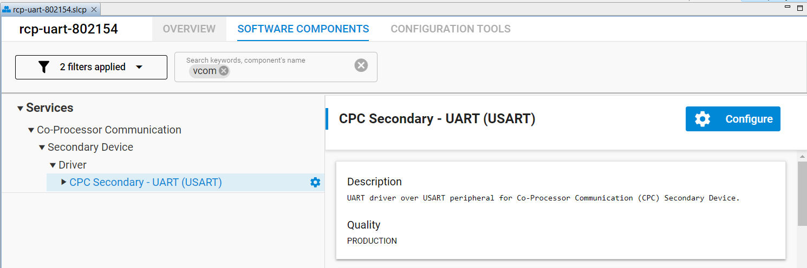
   </p>

4. Open the component editor for `CPC Secondary - UART (USART)` and assign `USART0` to `SL_CPC_DRV_UART_VCOM`.

   <p align="center">
     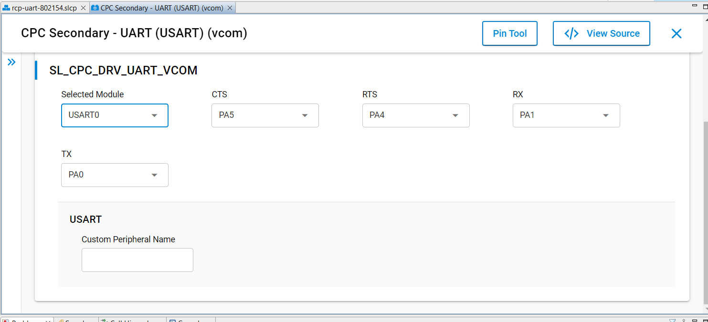
   </p>
   Exit.

5. Search for `PTI`.

   <p align="center">
     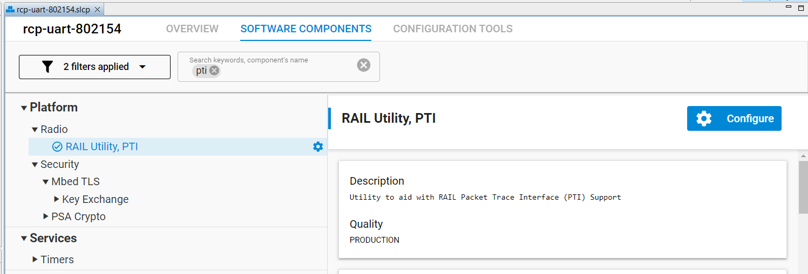
   </p>

6. Open the component editor for `RAIL Utility, PTI` and assign `PB12` to `DOUT`.

   <p align="center">
     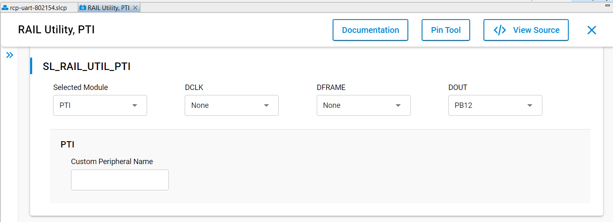
   </p>
   Exit.

7. Search for `coex`.

   <p align="center">
     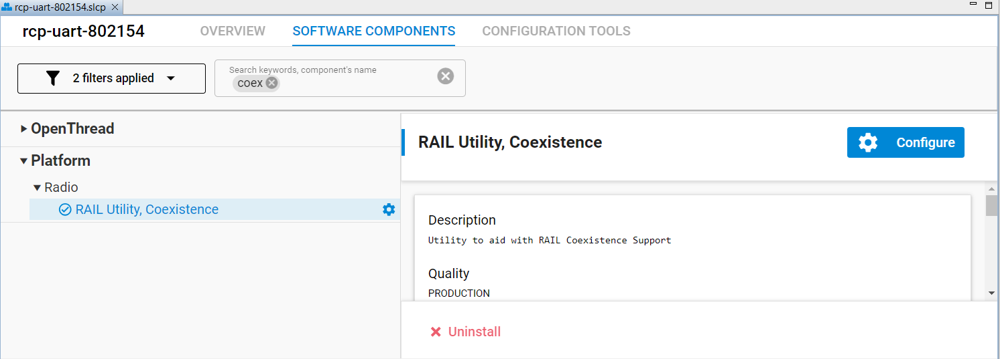
   </p>

8. Open the component editor for `RAIL Utility, Coexistence` and assign `PRS Channel CH0` to `SL_RAIL_UTIL_COEX_DP_REQUEST_INV`.

   <p align="center">
     
   </p>
   Exit.
At this stage, the initial pre-compilation warnings should have disappeared.

---

## Step 4 - Disable CPC security
This is optionnal. If you don't do it you will have to provide security keys.
Search for `CPC Security` and open the component. Disable `CPC Security Configuration` (enabled by default).

   <p align="center">
     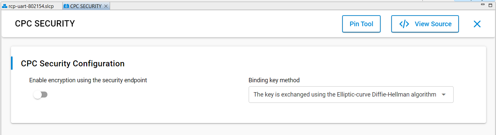
   </p>
Exit.

---

## Step 5: Delay the EFR32MG1B Boot Process

The boot process must be delayed to allow the `RTL8196E` bootloader to complete its initialization; otherwise, the `EFR32MG1B232F256GM48` boot sequence will interfere, preventing the loading of the Linux kernel and associated file system.

1. In the **Software Components** tab, remove the previous filters and search for `Microsecond Delay`.
2. Install the `Microsecond Delay` function.

   <p align="center">
     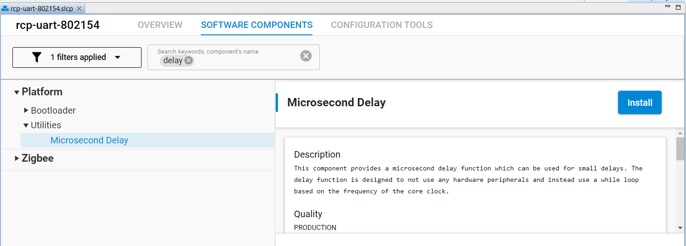
   </p>

3. Edit the `main.c` file and add:

   ```
   #include "sl_udelay.h"
   ```
4. At the beginning of `int main(void)`, insert:

   ```
   // Add 1sec delay before any reset operation to accomodate RTL8196E boot
   sl_udelay_wait(1000000);     // 1s delay
   ```
   The `main.c` file should now look like:
    <p align="center"> 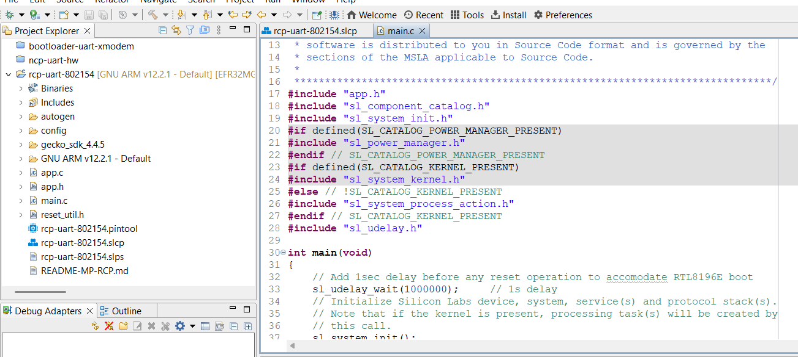 </p>

    Save the file.
	
---

## Step 6: define post-build command to create gbl file
The `rcp-uart-802154.gbl` file is not created by default. You have to define post-build instructions.
Right-click on the project name and go to `properties --> C/C++ Build -> Settings --> Build Steps` and enter:

   ```
   "C:\SiliconLabs\SimplicityStudio\v5\developer\adapter_packs\commander\commander.exe" gbl create rcp-uart-802154.gbl --app rcp-uart-802154.s37 
   ```

   <p align="center">
     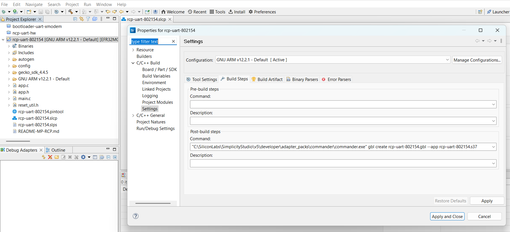
   </p>

---

## Step 7: build the firmware

Right-click on the project name (`rcp-uart-802154`) in the left-panel and click on `Build Project`. 
The compilation should run without any errors. The generated file `rcp-uart-802154.gbl` is located in the `GNU ARM v12.2.1 - Default directory` ready to be flashed.


