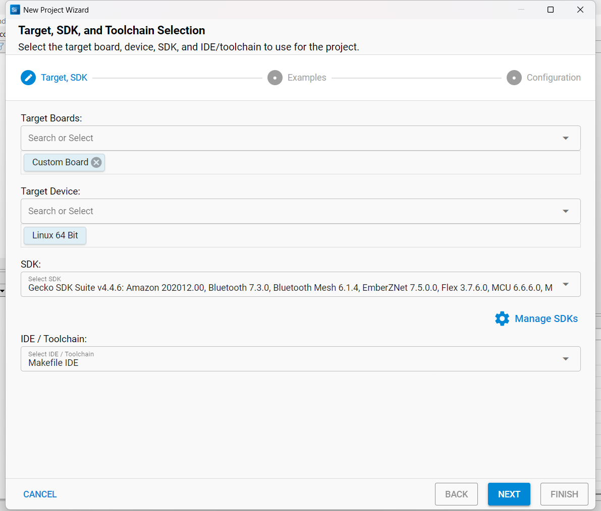
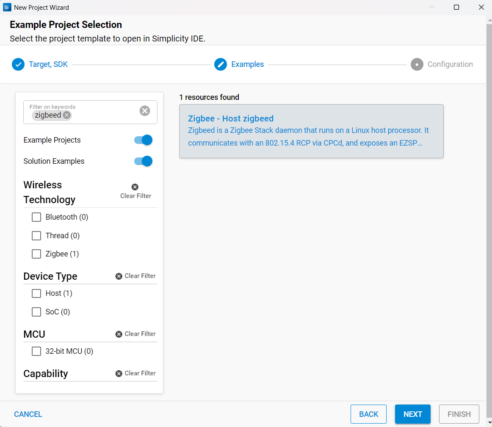
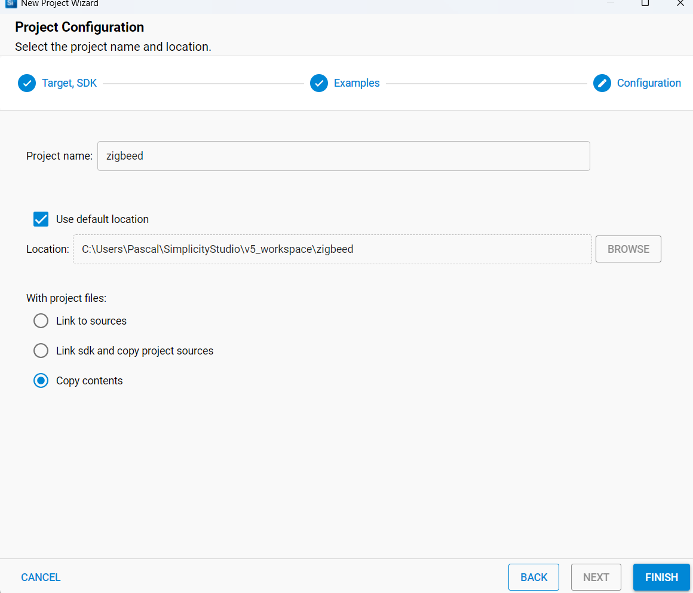
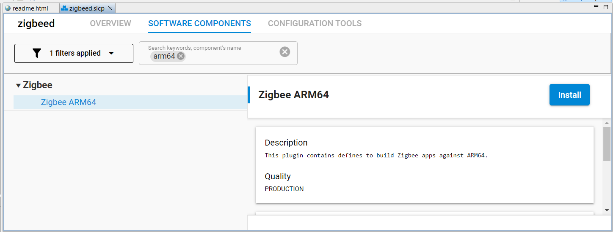

# zigbeed

`zigbeed` is a lightweight daemon designed specifically for managing Zigbee networks using the Silicon Labs RCP-UART firmware. It bridges Zigbee devices with TCP/IP-based clients or local processes, simplifying their integration into home automation ecosystems.

## Purpose and Benefits

Using `zigbeed` with RCP-UART firmware has several advantages compared to other Zigbee management solutions:

- **Efficiency**: Minimal resource consumption, ideal for embedded environments. This is especially true for the Lidl/Silvercrest gateway, whose EFR32MG1B232F256 chip has only 256K of memory.
- **Reliability**: Robust handling of communication errors, ensuring stable operation.
- **Easy Integration:** Compatible with home automation platforms like Home Assistant or zigbee2mqtt via TCP connections.
- **Flexible and Scalable:** Running `zigbeed` allows easy network management, facilitating debugging and improving maintainability on host systems with more resources, while leaving the Zigbee gateway dedicated to low-level operations.

## How it Works

`zigbeed` communicates directly over UART with the Silicon Labs Zigbee RCP firmware, converting Zigbee frames into network packets. This facilitates remote or local management of Zigbee devices seamlessly.

## Building Zigbeed

**Prerequisite:** Before building `zigbeed`, you must install `cpcd` and ensure it is running correctly. See the [cpcd build instructions](../cpcd).

For a Zigbee RCP setup with `cpcd`, `zigbeed` must be built and installed to manage the Zigbee Networking Stack. The following steps outline the process for compiling and deploying `zigbeed` on your host system.

### 1. Checking Host Architecture

Before proceeding with the installation, check the architecture of the host system where `zigbeed` will be installed. On a Raspberry Pi 3, for example, you can verify this with:

```sh
uname -m
```

If the output is:

```sh
aarch64
```

This indicates a 64-bit ARM architecture. Other possible results include:

- `x86_64` for a 64-bit x86 architecture.
- `armv7l` for a 32-bit ARM architecture.

In the next step are going to generate the corresponding `zigbeed` source file for your platform. Pre-configured source files for ARM32, ARM64, and X86_64 architectures are available in the [source](./source/) subdirectory. These files have been generated with the Gecko SDK version **4.4.6**, ensuring compatibility with the [RCP firmware](../../gateway_firmware/RCP-UART-HW/firmware) built from the same SDK version.


### 2. Build Process

2.1. In Simplicity Studio create a new zigbeed project: **File > New > Silicon Labs Project Wizard**.

2.2. Select your Target Device: **Linux 32 bit or Linux 64 bit**.

2.3. Select your IDE / Toolchain: **Makefile IDE**.

   <p align="center">
     
   </p>
   Enter Next
   
2.4. Search for **zigbeed** and Select the **Zigbee - Host zigbeed** project.

   <p align="center">
     
   </p>
   Enter Next
   
2.5. Before clicking Finish, it is recommended to select **Copy Contents**. This simplifies building the application on the `zigbeed` host by copying all required SDK files (rather than symlinking).

   <p align="center">
     
   </p>
   Enter Finish
   
2.6. In `zigbeed` Software components Tab search for `Zigbee ARM64` and Install the component:
   <p align="center">
     
   </p>
   
   **Note:** You may have to search for `Zigbee x86_64` or `Zigbee ARM32` depending on your host architecture (see Host Architecture above).

2.7. Zip the `zigbeed` folder in `v5_workspace`. The `zigbeed`source file is now ready for compilation on the host.

2.8. Transfer the file on the host and unzip the `zigbeed` folder.

2.9. Navigate into the `zigbeed` folder and build `zigbeed`:

```sh
make -f zigbeed.Makefile
```

2.10. Upon successful build, the executable will be located in `./build/debug/zigbeed`. We strip it and move it to `/usr/local/bin`

```
strip --strip-unneeded build/debug/zigbeed
sudo install -m 755 build/debug/zigbeed /usr/local/bin/zigbeed
```
You can now - optionnally -  delete the installation directory.

### 3. Configure Virtual Serial Devices with `socat`

The `socat` command is used to create virtual serial ports to connect the `zigbeed` daemon to the host application (e.g. Zigbee2MQTT). This is necessary because `zigbeed` communicates with the RCP via the CPC daemon (`cpcd`), but often the host application expects a traditional serial port interface.

```sh
sudo socat pty,link=/dev/ttyZigbeeNCP pty,link=/tmp/ttyZigbeeNCP
```

Explanation:

- `socat`: A multipurpose relay tool that creates bidirectional data streams between two endpoints.
- `pty,link=/dev/ttyZigbeeNCP`: Creates a virtual serial port (pseudo-terminal) and links it to `/dev/ttyZigbeeNCP`.  `/dev/ttyZigbeeNCP` is the virtual serial port that Zigbee2MQTT will connect to.
- `pty,link=/tmp/ttyZigbeeNCP`: Creates another virtual serial port and links it to `/tmp/ttyZigbeeNCP`. `/tmp/ttyZigbeeNCP` is the socket file that zigbeed will create and use for communication.

Why is socat Needed?
- `zigbeed` communicates with the RCP via the CPC daemon (`cpcd`) and exposes its interface as a socket (`/tmp/ttyZigbeeNCP`).
- `Zigbee2MQTT`, however, expects a traditional serial port (e.g., `/dev/ttyZigbeeNCP`).
- `socat` bridges the gap by creating a virtual serial port (`/dev/ttyZigbeeNCP`) that forwards data to the socket (`/tmp/ttyZigbeeNCP`).


### 4. Configure `zigbeed.conf`

Create and edit your `zigbeed.conf` configuration file as follows:

```bash
sudo nano /usr/local/etc/zigbeed.conf
```

Insert:

```
# radio-url: Specifies the connection to the Radio Co-Processor (RCP).
# The format is `spinel+cpc://<interface>?<parameters>`.
# - `cpcd_0`: Refers to the instance of the CPC daemon (cpcd) managing the RCP.
# - `iid=1`: Instance ID of the RCP (must match the ID used by cpcd).
# - `iid-list=0`: List of instance IDs to query (0 means all).
radio-url=spinel+cpc://cpcd_0?iid=1&iid-list=0

# ezsp-interface: Specifies the path to the virtual serial port (socket) that zigbeed will create.
# This is the interface that Zigbee2MQTT will connect to.
# `/tmp/ttyZigbeeNCP` is the socket file that zigbeed will create.
ezsp-interface=/tmp/ttyZigbeeNCP

# debug-level: Sets the verbosity of logging.
# - `5`: Maximum debug level (useful for troubleshooting).
debug-level=5

# verbose: Enables additional verbose logging if set to a non-empty value.
# (Currently empty in your configuration.)
verbose=
```

## Running Zigbeed 

### Auto-starting socat and zigbeed with systemd

To automatically restart `socat` and `zigbeed` after system reboot (e.g., after a power failure), configure systemd user units as follows:

In the `/etc/systemd/system/`directory create the `socat-zigbeed.service` file:

```ini
[Unit]
Description=Socat Virtual Serials for Zigbeed
After=network.target

[Service]
ExecStart=/usr/bin/socat pty,link=/dev/ttyZigbeeNCP pty,link=/tmp/ttyZigbeeNCP
Restart=always
RestartSec=5

[Install]
WantedBy=default.target
```

In the same directory cretae another `zigbeed.service` file:

```ini
[Unit]
Description=zigbeed Daemon
After=socat-zigbeed.service
Requires=cpcd.service

[Service]
ExecStart=/usr/local/bin/zigbeed
Restart=always
RestartSec=5

[Install]
WantedBy=default.target
```

Activate these services:

```bash
sudo systemctl daemon-reload
sudo systemctl enable socat-zigbeed.service zigbeed.service
sudo systemctl start socat-zigbeed.service zigbeed.service
```

### 5. Verifying Communication

To check if `zigbeed` has started correctly, use the following methods:

#### Check the systemd service status

If you started `zigbeed` with `systemd`, check its status. If `zigbeed` is running correctly, you should see `Active: active (running)` in the output.

```bash
jnilo@raspberrypi:~$ systemctl status zigbeed
● zigbeed.service - zigbeed Daemon
     Loaded: loaded (/etc/systemd/system/zigbeed.service; enabled; preset: enabled)
     Active: active (running) since Sun 2025-03-16 17:53:47 CET; 3min 35s ago
 Invocation: bdb2b67a6c8a47a1a26728ab06cf4491
   Main PID: 151347 (zigbeed)
      Tasks: 2 (limit: 697)
     Memory: 468K (peak: 1.5M)
        CPU: 1.203s
     CGroup: /system.slice/zigbeed.service
             └─151347 /usr/local/bin/zigbeed

Mar 16 17:53:50 raspberrypi zigbeed[151347]: [D] P-SpinelDrive-: Sent spinel frame, flg:0x2, iid:1, tid:5, cmd:PROP_VALUE_GET, key:RADIO>
Mar 16 17:53:50 raspberrypi zigbeed[151347]: [D] P-RadioSpinel-: Wait response: tid=5 key=4619
Mar 16 17:53:50 raspberrypi zigbeed[151347]: zigbeed[151347]: [D] P-SpinelDrive-: Received spinel frame, flg:0x2, iid:1, tid:5, cmd:PROP>
Mar 16 17:53:50 raspberrypi zigbeed[151347]: [D] P-SpinelDrive-: Received spinel frame, flg:0x2, iid:1, tid:5, cmd:PROP_VALUE_IS, key:RA>
Mar 16 17:53:50 raspberrypi zigbeed[151347]: zigbeed[151347]: Zigbeed started
Mar 16 17:53:50 raspberrypi zigbeed[151347]: zigbeed[151347]: RCP version: SL-OPENTHREAD/2.4.5.0_GitHub-797150858; EFR32; Mar 11 2025 14>
Mar 16 17:53:50 raspberrypi zigbeed[151347]: zigbeed[151347]: Zigbeed Version: GSDK 7.5.0 - Feb 27 2025 - 02:58:50
Mar 16 17:53:50 raspberrypi zigbeed[151347]: Zigbeed started
Mar 16 17:53:50 raspberrypi zigbeed[151347]: RCP version: SL-OPENTHREAD/2.4.5.0_GitHub-797150858; EFR32; Mar 11 2025 14:35:31
Mar 16 17:53:50 raspberrypi zigbeed[151347]: Zigbeed Version: GSDK 7.5.0 - Feb 27 2025 - 02:58:50
jnilo@raspberrypi:~$
```

#### Check logs using journalctl

To view logs from `zigbeed`, use:

```bash
journalctl -u zigbeed.service --follow
```

This will display live logs of `zigbeed` in real-time.


Connect home automation software via TCP:

```yaml
version: 4
homeassistant:
  enabled: false
frontend:
  enabled: true
mqtt:
  base_topic: zigbee2mqtt
  server: mqtt://localhost
serial:
  port: /dev/ttyZigbeeNCP
  adapter: ember
```


## Troubleshooting

- **Serial Communication Issues:** Verify UART permissions and connections.
- **Log Inspection:** Default logs located at `/var/log/zigbeed.log`.

## Additional Resources

- [Official Silicon Labs Zigbeed Documentation](https://docs.silabs.com/zigbee/latest/multiprotocol-solution-linux/building-zigbee-hosts-locally)


